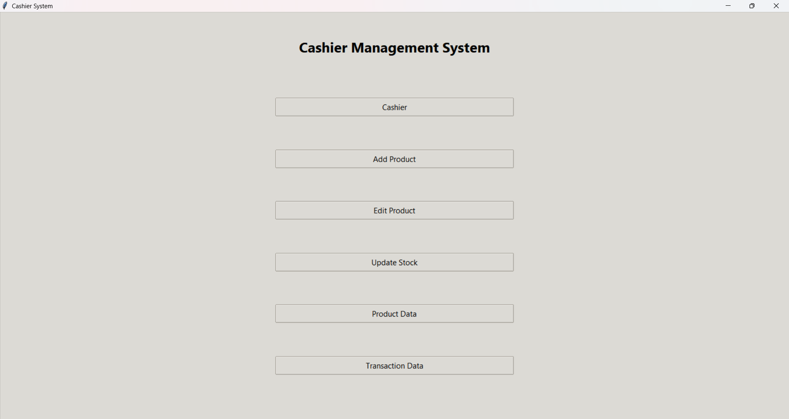
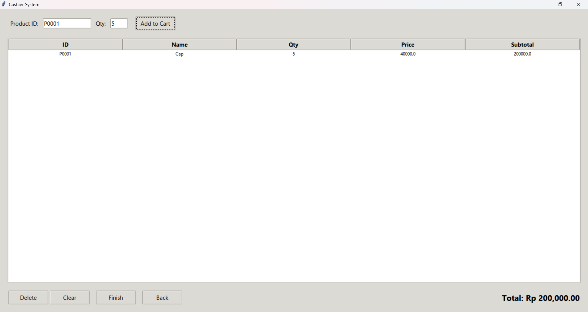
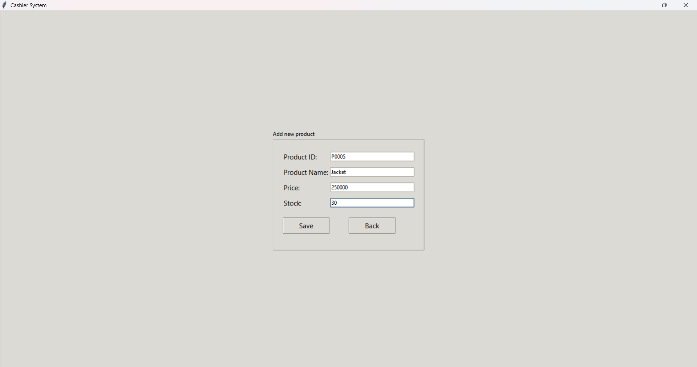
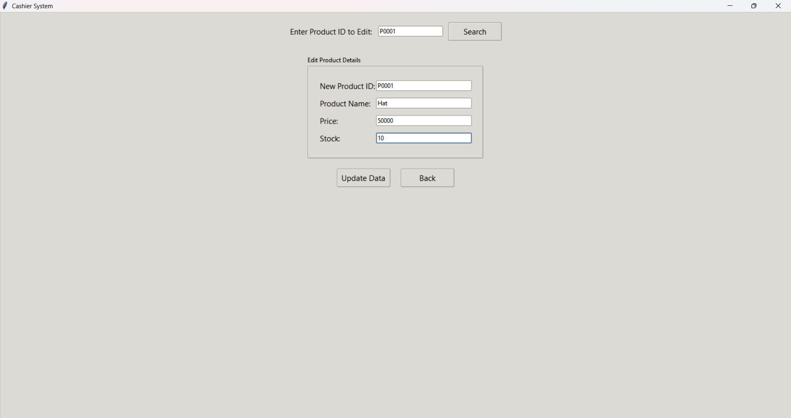
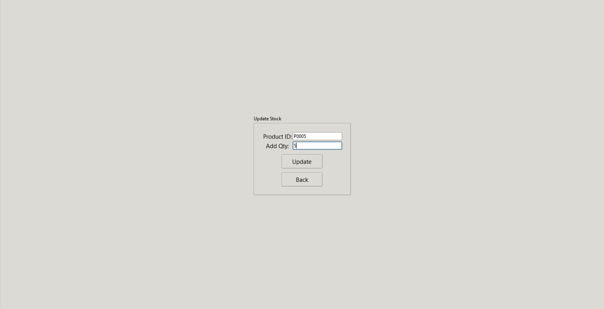
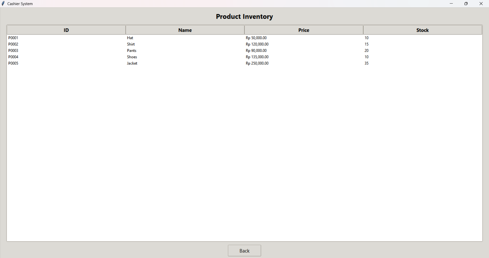
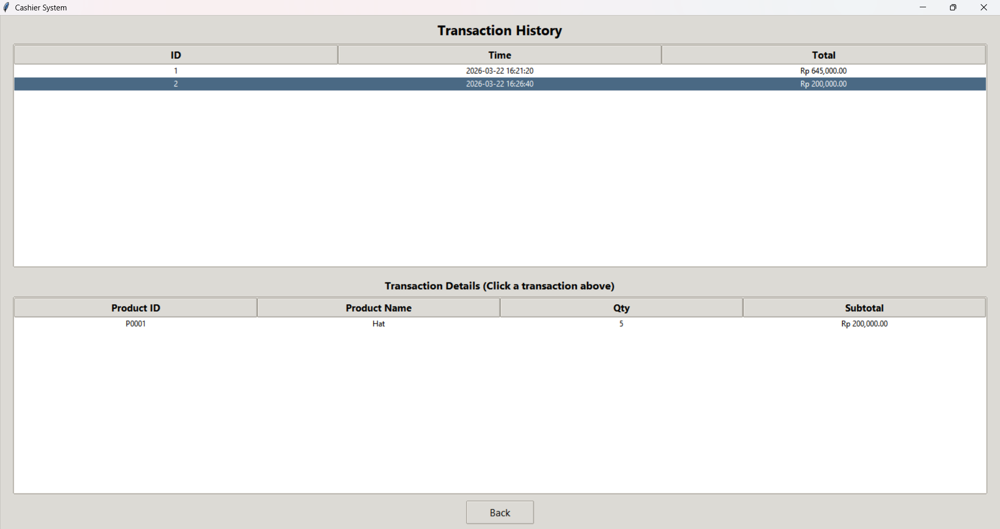

# Cashier Management - Python

Saya membuat aplikasi desktop dengan format .exe menggunakan bahasa pemrograman Python, dengan library Tkinter yang terintegrasi dengan SQLite sebagai basis penyimpanan data.

Terdapat 6 menu utama pada aplikasi saya, yaitu:

1. Cashier

Menu "Cashier" merupakan wadah untuk menginput transaksi yang akan disimpan di database. Pengguna cukup memasukkan id barang dan kuantitas, lalu menekan tombol "Add to Cart". Pengguna dapat menginput lebih dari 1 produk, kemudian pengguna dapat menekan tombol "Finish" apabila ingin menyelesaikan transaksi. Tersedia juga tombol "Delete" untuk menghapus barang di keranjang, tombol "Clear" untuk menghapus semua barang di keranjang, dan tombol "Back" untuk kembali ke "Home". Sebagai contoh, saya akan melakukan transaksi berupa 5 topi, dengan harga per topi sebesar 50.000.

2. Add Product

Menu "Add Product" bermanfaat untuk membantu pengguna, apabila pengguna ingin menambahkan produk baru. Nantinya pengguna diminta untuk mengisi data produk baru terlebih dahulu, meliputi "Product ID", "Product Name", "Price", dan "Stock". Setelah semua data terisi, pengguna dapat menekan tombol "Save" untuk menambah produk baru ke database. Tersedia juga tombol "Back" untuk kembali ke "Home". Sebagai contoh, saya akan menambah produk baru, yaitu jaket. 

3. Edit Product

Menu "Edit Product" bermanfaat untuk membantu pengguna, apabila pengguna ingin mengubah data produk yang sudah terdaftar di database. Nantinya pengguna diminta untuk mengisi data berupa "Product ID" terlebih dahulu, kemudian menekan tombol "Search" untuk mencari id produk yang ingin diubah. Setelah sistem berhasil menemukan id produk yang ingin diubah, pengguna dapat mengubah data produk berupa "Product ID", "Product Naame", "Price", dan "Stock" dengan data yang baru. Setelah mengisi data baru, pengguna dapat menekan tombol "Update Data" dan sistem akan memperbarui data produk. Terdapat juga tombol "Back" untuk kembali ke "Home". Sebagai contoh, saya mengubah data yang semula adalah [Cap, 40.000, 20] menjadi [Hat, 50.000, 10].

4. Update Stock

Menu "Update Stock" bermanfaat untuk membantu pengguna, apabila pengguna ingin menambah stok yang dimiliki. Nantinya pengguna diminta untuk mengisi data berupa "Product ID" dan "Add Qty". Data "Add Qty" ini akan ditambahkan ke data "Stock" dari produk yang sudah dipilih pengguna. Setelah mengisi data, pengguna dapat menekan tombol "Update" dan sistem akan memperbarui stok produk. Terdapat juga tombol "Back" untuk kembali ke "Home". Sebagai contoh, saya menambah stok dari produk jaket sebanyak 5 buah.

5. Product Data

Menu "Product Data" bermanfaat untuk membantu pengguna, apabila pengguna ingin memantau informasi terkait produk yang ia miliki. Nantinya sistem akan menampilkan data produk berupa "ID", "Name", "Price", dan "Stock". Terdapat juga tombol "Back" untuk kembali ke "Home". Terlihat bahwa produk dengan ID "P0001" sudah berubah dari "Cap" menjadi "Hat". Stok untuk produk jaket juga sudah bertambah dari yang awalnya 10 buah, kini menjadi 15 buah.

6. Transaction Data

Menu "Transaction Data" bermanfaat untuk membantu pengguna, apabila pengguna ingin melacak histori transaksi. Nantinya sistem akan menampilkan data transaksi berupa "ID", "Time", dan "Total". Pengguna dapat memilih salah satu transaksi, kemudian sistem akan menampilkan detail transaksi dengan data berupa "Product ID", "Product Name", "Qty", dan "Subtotal" dari transaksi yang dipilih oleh pengguna.